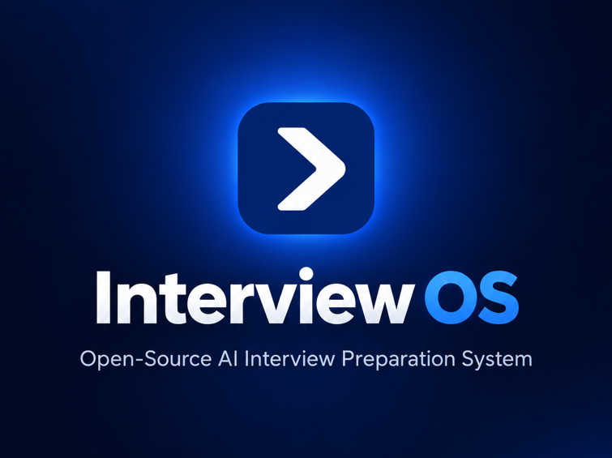

<p align="center">
  
</p>

# Interview OS is interview preparation that learns from your answers.

**A local-first, open-source workspace for turning a resume and job description into a targeted prep plan, realistic mock interviews, and an evidence-backed view of your readiness.**

[Quickstart](#quickstart) · [See the workflow](#how-it-works) · [Features](#features) · [Screenshots](#screenshots) · [Development](#development)

Most interview tools give you a question list. Interview OS connects the whole preparation cycle: it finds the skills a role needs, helps you practice them, evaluates your answers, and uses the results to decide what to work on next.

| Step | What happens |
| --- | --- |
| 01 · Set a target | Add your resume and a job description, or load a bundled example. |
| 02 · Prepare and interview | Follow a prioritized plan, practice one skill, or run a focused round or full interview loop. |
| 03 · Improve | Review the evidence behind each readiness score. Weak answers move skills up the plan and can be retested in later rounds. |

## Interview OS is for you if

- You want preparation tied to a **specific role**, rather than a generic question bank.
- You want to see **why** a skill is marked strong or weak.
- You want technical, coding, system design, behavioral, hiring manager, and HR practice in one place.
- You want to track progress across interviews and revisit weaknesses deliberately.
- You prefer a local app with a deterministic mock mode for trying the workflow without an AI provider.

## How it works

```text
Resume + job description
        ↓
Skill gaps → prioritized prep plan
        ↓
Practice or mock interview → answer evaluation
        ↓
Evidence-backed readiness → updated plan → next interview
                              ↖ weak skills get retested ↗
```

For example, if you give a vague answer about cache invalidation, Interview OS records that answer as evidence for the relevant skill. Its readiness score and prep priority change, and a later interview can probe that weakness again. Scores are derived from evidence, with the supporting entries visible in the app. Older evidence loses weight over time.

## Features

### 🎯 Prep built around your target

Analyze a resume against a job description, see the skill gaps, and get a plan ordered by role importance and current readiness. Keep multiple target roles for one candidate; each target has its own gaps and plan while sharing the candidate's evidence.

### 🧭 Readiness you can inspect

Each skill's score is backed by interview answers, practice, self-checks, or resume claims. The Readiness view shows the evidence and history behind it instead of presenting an unexplained number.

### 🎙️ Interviews with a purpose

Run technical, coding, system design, behavioral, hiring manager, HR, or mixed sessions. Build a multi-round loop, carry observations between rounds, and get a debrief showing strengths, weaknesses, and readiness changes. Coding answers are reviewed as text; they are **not executed**.

### 🔁 Practice that responds to weakness

Question selection considers the target role, readiness gaps, uncertainty, recent questions, and weaknesses from earlier rounds. Complete a prep action with a self-check or answer a practice question to add fresh evidence.

### 📝 Help with your application materials

Review your resume for ATS basics, get guarded bullet suggestions and role tailoring, and build a STAR story bank for behavioral interviews. Suggested rewrites are never applied automatically; check them before use.

### 🏢 Company-shaped loops

Choose a generic profile or a built-in Google, Meta, Amazon, or Microsoft-style profile to shape the round sequence and emphasis. These profiles are **heuristics based on commonly reported patterns**, not official company interview guides.

### 📊 One place to follow progress

Browse interview history, answer feedback, per-skill readiness changes, prep actions, and progress metrics. Use the command palette with `Ctrl/Cmd+K` to jump to common actions.

### 🔌 Local runtimes and plugins

Use a locally installed Codex CLI by default, choose Claude Code, opencode, or Devin, or use the deterministic mock runtime. Skills declare their inputs and permissions; local plugins can read declared state slices and cannot write application state. Only install plugin code you trust, because plugins run in the server process.

## Screenshots

| Home and progress | Coding answer evaluation |
| --- | --- |
|  |  |
| **Multi-round debrief** | **Evidence-backed readiness** |
|  |  |

## Quickstart

**Requirements:** Node.js 24, [pnpm](https://pnpm.io/) 12, and Git. The default AI runtime also needs a locally installed and signed-in [Codex CLI](https://github.com/openai/codex). You can try the complete workflow without Codex using mock mode.

```sh
git clone https://github.com/interview-ps/InterviewOS.git
cd InterviewOS
pnpm install
INTERVIEW_OS_RUNTIME=mock pnpm dev
```

Open [http://localhost:3000](http://localhost:3000). The web app runs on port 3000 and the API on port 4100. To use your local Codex installation instead, stop the mock server and run `pnpm dev`.

On Windows PowerShell, start mock mode with `$env:INTERVIEW_OS_RUNTIME="mock"; pnpm dev`. If your machine blocks `pnpm.exe` under Application Control, use `corepack pnpm` for the commands above. For other Windows install failures — a `better-sqlite3` build error or `corepack pnpm` not launching — see the [Windows setup notes](CONTRIBUTING.md#setup), which also cover the test-runner caveat.

### Try the feedback loop

1. Open **Target Role** and load the `backend-engineer` example.
2. Analyze it to see gaps in caching, distributed systems, and system design, then open the prep plan.
3. Start a technical interview. Give a vague caching answer, such as “I'd put Redis in front of the database.”
4. Open **Readiness** to inspect the weak evidence, then **Prepare** to see the updated priority.
5. Start another interview to see that weakness come back into focus.

The mock runtime makes this walkthrough repeatable without AI calls. For your own resume and role, use a configured AI runtime. Resume and job description inputs accept PDF, DOCX, TXT, and Markdown files up to 5 MB.

## Works with

<div align="center">
<table>
  <tr>
    <td align="center"><strong>Works<br/>with</strong></td>
    <td align="center" valign="top"><picture><source media="(prefers-color-scheme: dark)" srcset="docs/assets/logos/opencode-dark.svg" /></picture><br/><sub>opencode</sub></td>
    <td align="center" valign="top"><br/><sub>Claude Code</sub></td>
    <td align="center" valign="top"><br/><sub>Codex</sub></td>
    <td align="center" valign="top"><picture><source media="(prefers-color-scheme: dark)" srcset="docs/assets/logos/devin-dark.png" /></picture><br/><sub>Devin</sub></td>
  </tr>
</table>
</div>

## AI runtimes and local data

| Runtime | Select with `INTERVIEW_OS_RUNTIME` | How to start |
| --- | --- | --- |
| Codex (default) | `codex` or unset | Install and sign in to the Codex CLI, then run `pnpm dev`. |
| Claude Code | `claude` | Sign in with the Claude Code CLI, then run `INTERVIEW_OS_RUNTIME=claude pnpm dev`. |
| opencode | `opencode` | Sign in with `opencode auth login`, then run `INTERVIEW_OS_RUNTIME=opencode pnpm dev`. |
| Devin | `devin` | Sign in with `devin auth login`, then run `INTERVIEW_OS_RUNTIME=devin pnpm dev`. |
| Mock | `mock` | Run `INTERVIEW_OS_RUNTIME=mock pnpm dev`; no AI provider required. |

Interview OS keeps application state in a local SQLite database (`data/interview-os.db` by default). When you select a real AI runtime, the content needed for analysis and interviewing is sent through that provider's local tooling. The app does not ask you to paste an API key into Interview OS. See [Architecture](ARCHITECTURE.md) for the runtime and data flow.

## Configuration

| Variable | Default | Purpose |
| --- | --- | --- |
| `INTERVIEW_OS_RUNTIME` | `codex` | `codex`, `claude`, `opencode`, `devin`, or `mock` |
| `INTERVIEW_OS_RUNTIME_FALLBACK` | none | Set to `mock` to use mock mode if the selected runtime is unavailable |
| `INTERVIEW_OS_PORT` | `4100` | API server port |
| `INTERVIEW_OS_DB` | `data/interview-os.db` | SQLite database path |
| `INTERVIEW_OS_PLUGINS_DIR` | `<repo>/plugins` | Local plugin discovery directory |

Runtime model, reasoning effort, and task mode can be changed in **Settings**. For provider-specific paths, timeouts, and test settings, see [Architecture](ARCHITECTURE.md) and the runtime code in [`packages/runtime`](packages/runtime).

## Under the hood

```text
apps/web             Next.js interface (port 3000)
        ↓
apps/server          Hono API (port 4100) + local SQLite
        ↓
packages/orchestrator   Interview and preparation workflows
        ↓
packages/core        Shared schemas, readiness, gaps, prioritization
packages/skills      Analyzers, planner, interviewer, evaluator, coaches
packages/runtime     Codex, Claude Code, opencode, Devin, and mock adapters
```

AI-generated state is schema-validated before it is saved. Readiness scores come from stored evidence, and snapshots are appended so changes can be inspected later. The [architecture guide](ARCHITECTURE.md) explains the design in detail; [AGENTS.md](AGENTS.md) records the project's core invariants.

## Development

```sh
pnpm typecheck
pnpm test
pnpm test:coverage
pnpm test:e2e
```

The integration test in `tests/integration/feedback-loop.test.ts` covers the product's central promise: a weak answer changes readiness and is retested. Live provider tests are opt-in. See [Contributing](CONTRIBUTING.md) for setup, testing, and how to add a skill, mode, plugin, or runtime.

## Roadmap

Planned work includes sandboxed execution for coding answers, voice interviews, and broader plugin support. See [the implementation plan](IMPLEMENTATION_PLAN.md) for the project plan; planned features are not part of the current app.

## Contributing and license

Contributions are welcome. Start with [CONTRIBUTING.md](CONTRIBUTING.md) and the invariants in [AGENTS.md](AGENTS.md).

Interview OS is [MIT licensed](LICENSE).

## Star History

<a href="https://www.star-history.com/?repos=interview-ps%2Finterviewos&type=date&logscale=&releases=&legend=bottom-right">
 <picture>
   <source media="(prefers-color-scheme: dark)" srcset="https://api.star-history.com/chart?repos=interview-ps/interviewos&type=date&theme=dark&legend=bottom-right" />
   <source media="(prefers-color-scheme: light)" srcset="https://api.star-history.com/chart?repos=interview-ps/interviewos&type=date&legend=bottom-right" />
   
 </picture>
</a>
